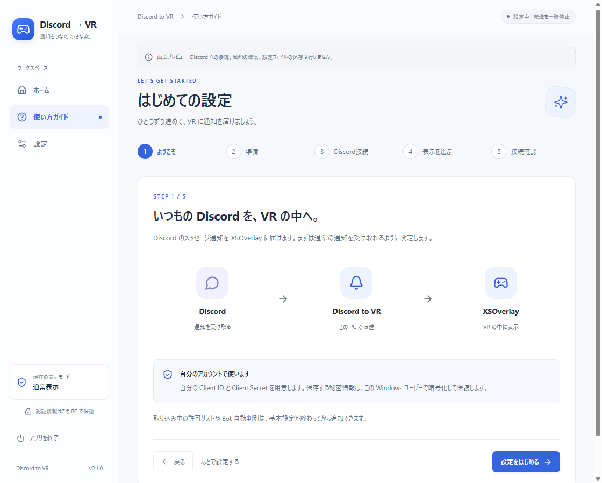
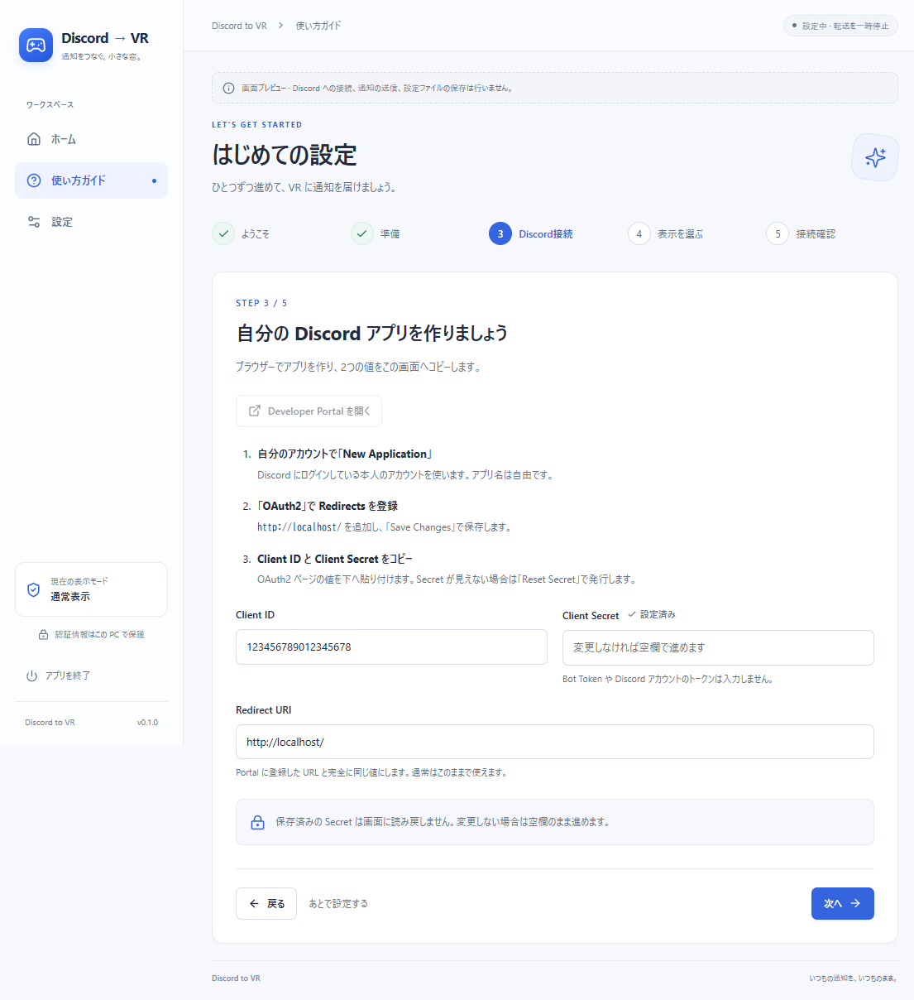
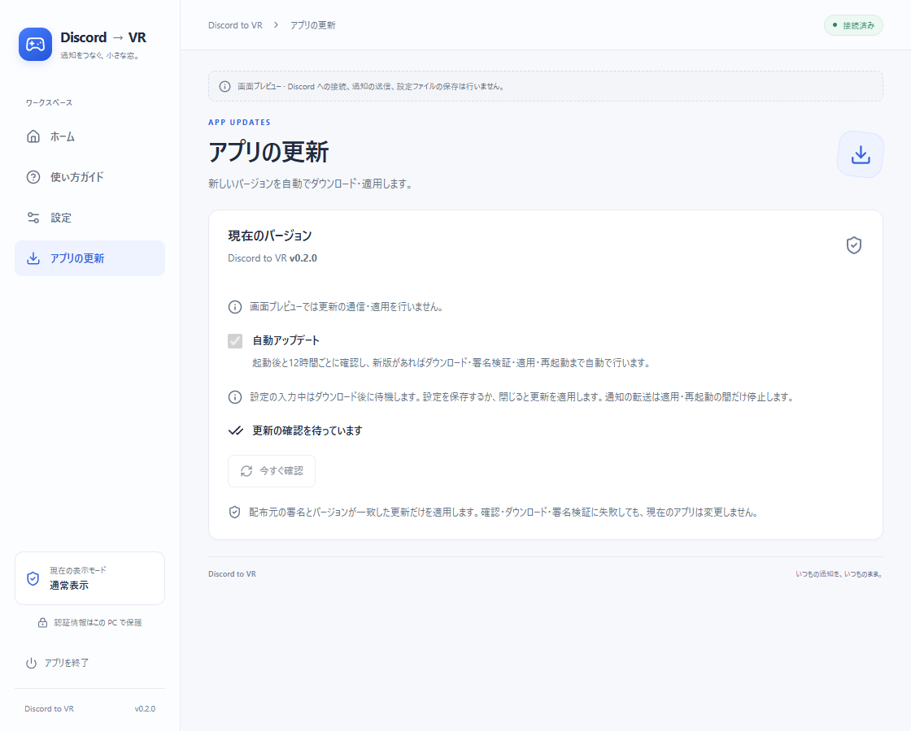
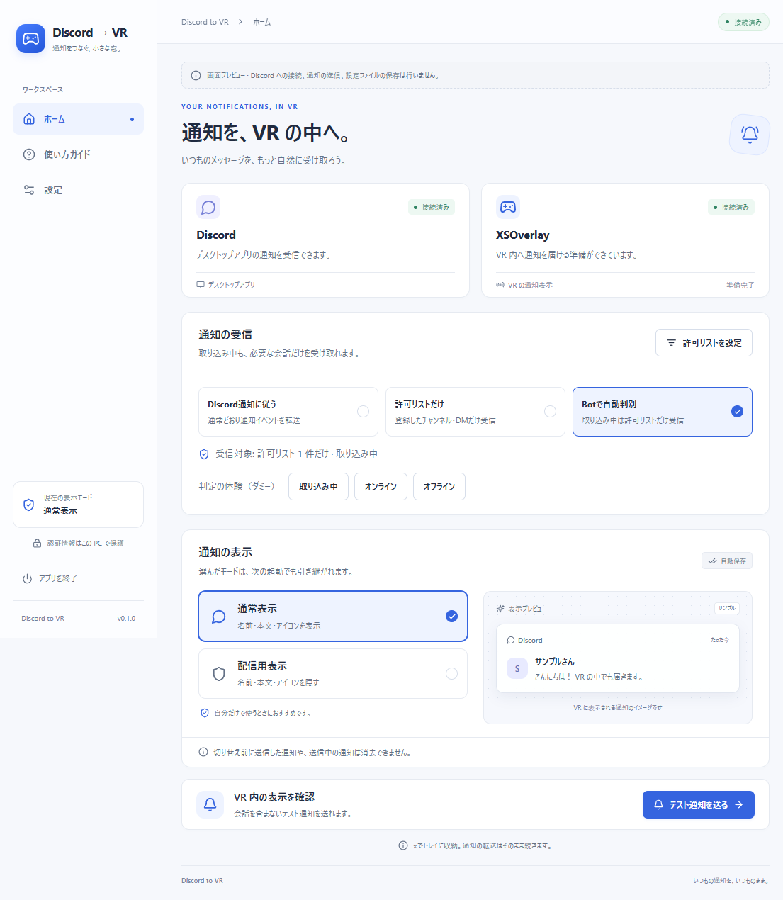
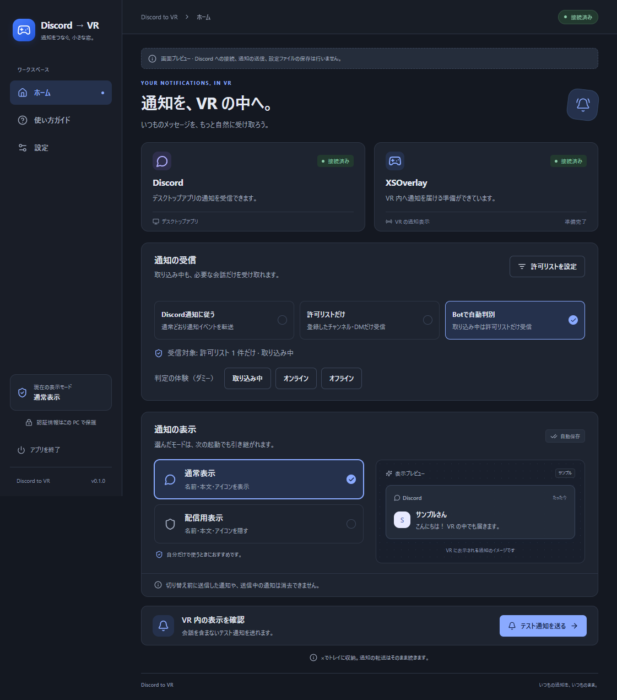
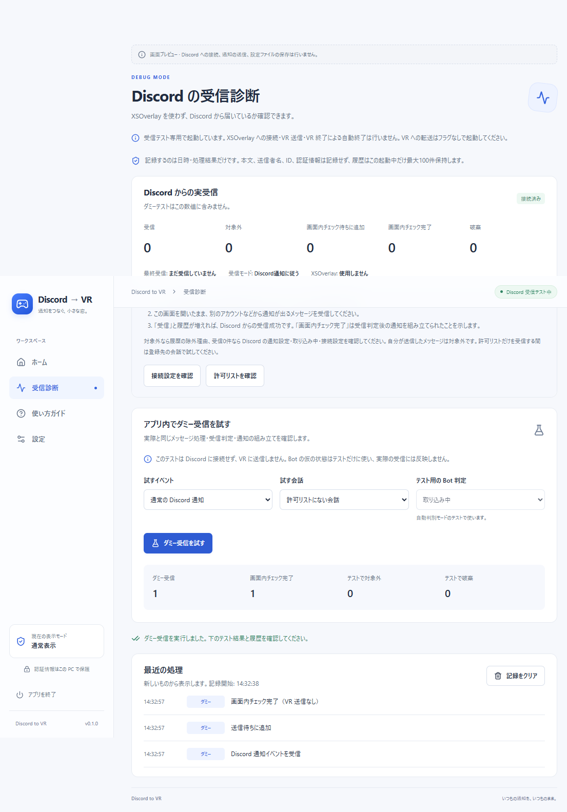
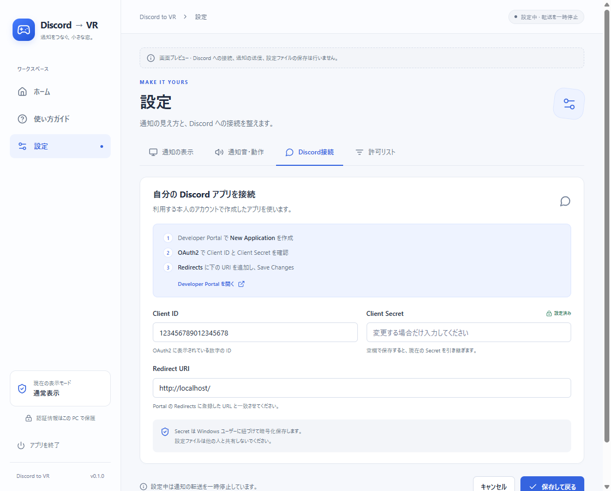
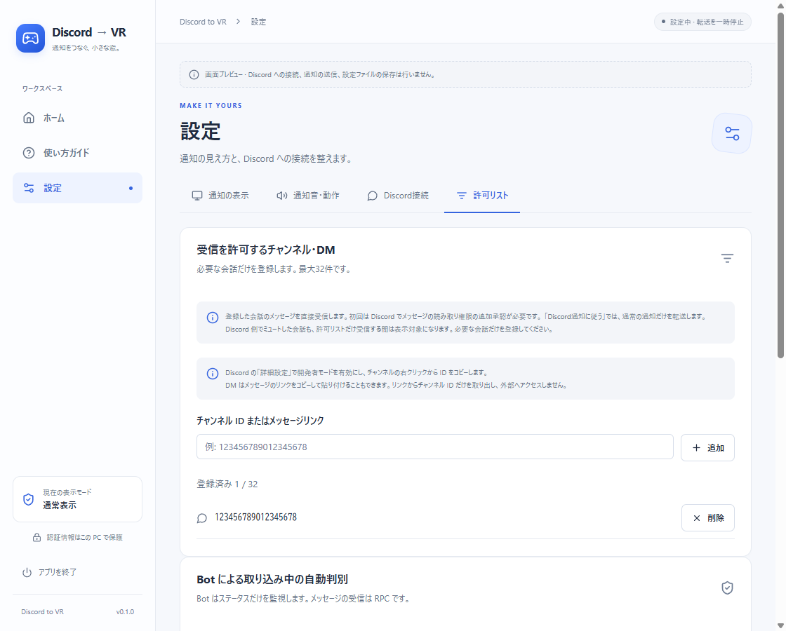
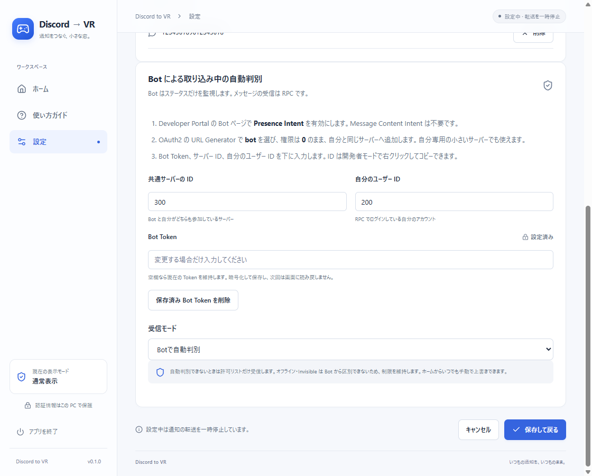

# 操作画面の使い方

Tauri 2 の新しい画面です。左のサイドバーからホームと設定を移動します。画像は実際の Tauri アプリを `--ui-preview` で起動したダミー情報の表示例です。

## 初回のチュートリアル

初回は5段階のチュートリアルが自動で開きます。必要なアプリの準備、自分の Discord アプリの作成と入力、通常／配信用表示の選択、接続確認まで案内します。

「Developer Portal を開く」でブラウザーを開き、画面の手順に沿って作ったアプリの Client ID・Client Secret を入力します。「次へ」では不足している入力を案内し、「保存して接続を確認」で設定を保存します。Discord の承認画面を確認し、XSOverlay と両方が接続済みになったらテスト通知を送れます。接続できる環境がまだない場合も、設定を保存してホームへ進めます。

「あとで設定する」・ホームへの移動・Esc・×で中断できます。未保存の Secret は破棄します。設定保存前は次回も最初から案内し、保存後は接続確認から再開します。接続確認から「戻る」を押すと、再設定の間は転送を停止します。

最後に「完了してホームへ」（未接続時は「接続はあとで・ホームへ」）を押すと、完了を保存します。許可リスト・Bot の追加設定へ進む場合も基本案内を完了します。完了後は次回からホームへ進み、サイドバーの「使い方ガイド」でいつでも再表示できます。有効な旧設定には初回案内を自動表示しません。

## 日常の操作

「アプリの更新」で自動アップデートの切り替え、バージョン、進行状況を確認します。インストーラー版は新版を自動でダウンロード・検証し、適用後に再起動します。設定入力中は閉じるまで待機します。ZIP 版やテスト起動の扱いは [自動アップデート](AUTO_UPDATE.md) を参照してください。

ホームの接続カードで Discord と XSOverlay を確認します。両方が接続済みになると右上に「接続済み」と表示します。未接続のカードには、次に確認する操作が表示されます。

「通常表示」は名前・本文・アイコンを表示します。サーバーの通知では本文の上に「サーバー名 / #チャンネル名」を追加します。「配信用表示」はサーバー名・チャンネル名も含めて隠します。名前が取得できないときも本文は届きます。選択中のボタンにチェックと色付きの枠を表示し、ダミーの通知プレビューで違いを確認できます。選んだモードは次回起動にも引き継ぎます。

設定 → 通知の表示 →「アプリのテーマ」で **システム・ライト・ダーク** を選べます。初期設定の「システム」は Windows の外観設定に合わせてライト・ダークを切り替えます。ライト・ダークを選ぶと OS の設定にかかわらず指定した色になります。選択中に画面の色を確認し、「保存して戻る」で次回起動にも引き継ぎます。キャンセル・×・Esc では保存前のテーマに戻ります。下の図はダークテーマの表示例です。図の接続状態と通知はテスト用のダミーです。

「テスト通知」は XSOverlay 接続中に使えます。通知は送信待ちに追加されるため、実際に VR 内で表示されたことを確認してください。会話や個人情報は使いません。

×・Esc はトレイへ収納する操作です。収納中も通知を転送します。VR アイコンを選ぶか、ショートカット・実行ファイルをもう一度開くと、起動済みの画面へ戻れます。新しい受信処理は起動しません。設定画面を開いている場合も、その画面を表示します。右クリックでモード変更・テスト・設定・終了を操作できます。アプリを停止する場合は「終了」を選びます。

## 受信できているか確認する

画面またはトレイの「アプリを終了」でいったん終了し、`discord_To_VR.exe -debug` で起動します。`--debug` でも同じです。XSOverlay・SteamVR は起動不要です。「受信診断」が開き、サイドバーからホームや設定にも移動できます。画面を変えても診断記録は続きます。この起動中は XSOverlay に接続・送信せず、VR 終了による自動終了も行いません。

1. 上の「Discord からの実受信」で、Discord の接続状態を確認します。XSOverlay は「使用しません」と表示されます。
2. 別アカウントなどから、Discord が通知を出すメッセージを受信します。ふだんのモードでは、対象会話を開いたままの場合や取り込み中・ミュートでは通知が出ない場合があります。許可リストだけのモードなら登録した会話で試します。
3. 「受信」と「最終受信」が変われば、アプリにイベントが届いています。「画面内チェック完了」が増えれば、判定後の通知も組み立てられています。対象外の場合は下の履歴で理由を確認します。

| 見たいこと | 操作・表示 |
| --- | --- |
| Discord から届いているか | 「実受信」の件数、最終時刻、履歴の「実受信」を確認 |
| 許可リストの判定が合っているか | ダミーのイベント種類と会話を選び「ダミー受信を試す」 |
| 自動モードの取り込み中／状態不明を試す | 自動モードを保存し、テスト用の Bot 判定を選んで実行 |
| VR への接続と表示を試す | フラグなしで起動し、ホームの「テスト通知を送る」を使用 |

ダミー受信は本番と同じメッセージ処理・キューの判定・通知の組み立てを使い、送信の直前で止めます。仮の Bot 状態と RPC アカウント一致を前提に、独立した受信判定で試します。Discord 認証・実際の Bot 接続・実際のチャンネル購読が成功したことを証明するテストではありません。「実受信」と「ダミー」は件数も履歴も別です。

診断中は VR のテスト通知を送りません。実際の VR の表示確認には通常起動を使ってください。ダミー受信が成功しても Discord からの実受信件数は増えません。

履歴には日時と固定の処理結果だけを最大100件表示します。本文・送信者名・ID・秘密情報を保存せず、アプリ終了時に消えます。「記録をクリア」は実受信とテストの件数も消します。通常起動では診断画面・記録を有効にしません。

## 設定

アプリの削除手順は [README のアンインストール案内](../README.md#アンインストールするには) を参照してください。インストーラー版は Windows のアプリ一覧から削除でき、設定を残すか、アプリデータも削除するかを選べます。

設定は `%APPDATA%\discord-to-vr\config.json` に保存します。以前の AppData フォルダーにある設定は、新しい保存先に設定がない場合に引き継ぎます。旧ファイルは残します。

設定中は転送を停止し、保存・キャンセル後に接続を再開します。タブを移動しても入力内容は保持します。「保存して戻る」で全タブの変更を保存し、「キャンセル」で変更を破棄します。

| タブ | 調整できる項目 |
| --- | --- |
| 通知の表示 | 表示時間、タイトル・本文の文字数、配信用表示 |
| 通知音・動作 | 無音・標準・音声ファイル、音量、自動終了 |
| Discord接続 | 自分の Client ID、Client Secret、Redirect URI |
| 許可リスト | チャンネル・DM の登録、受信モード、任意の自動判別用 Bot |

初回は Discord接続タブから案内します。自分の Discord アカウントでアプリを作り、Portal の Redirects と入力した URI を一致させます。Secret は入力中のみ伏せ字で表示し、Windows ユーザーに紐づけて暗号化保存します。保存済みの Secret は画面へ読み戻さず、欄を空にして「設定済み」と表示します。変更しなければ空欄で保存できます。Bot Token は自動判別を使う場合だけ、許可リストタブの専用欄へ入力します。

不正な数値や未入力の項目がある場合は保存せず、該当するタブと入力欄へ移動して案内します。画面の高さが足りない場合は、ホイールや右側のスクロールバーで下の操作へ移動できます。キーボードで入力欄やボタンへ移動したときも、その位置までスクロールします。

配信用表示に切り替えても、すでに送信した通知や送信処理中の通知は消去できません。配信を始める前に切り替えてください。

## 取り込み中も必要な会話を受信する

ホームの「通知の受信」は、通知の内容を隠す表示モードとは別に設定します。

| 選択 | 受信対象 |
| --- | --- |
| Discord通知に従う | Discord が通常の通知として発行した会話 |
| 許可リストだけ | 登録先だけ。Discord が取り込み中でもメッセージを直接受信 |
| Botで自動判別 | オンライン・退席中は通常受信、取り込み中は許可リストだけ |

1. ホームの「許可リストを設定」を開きます。
2. Discord の「詳細設定」で開発者モードを有効にします。チャンネルを右クリックして ID をコピーするか、DM を含むメッセージのリンクをコピーします。
3. 「チャンネル ID またはメッセージリンク」に貼り付けて「追加」を押します。DM は相手のユーザー ID ではなく、その会話のチャンネルを登録します。最大32件です。
4. 「保存して戻る」を押し、必要なら Discord のメッセージ読み取り権限（`messages.read`）を承認します。
5. ホームで手動の「許可リストだけ」を選べば Bot なしで使えます。登録先へのアクセス権が必要です。

許可リストだけを受信する間は、登録先のミュートやメンション限定などの通知設定によらずメッセージを転送します。空の許可リストでは会話の通知を転送しません。登録先の購読に失敗した場合はホームに案内を表示します。

## Bot で自動判別する

「設定 → 許可リスト」の下にある Bot 設定を使います。Bot は自分のステータスを判定し、メッセージの取得は引き続き RPC を使います。Bot で DM を読む必要はありません。

1. [Developer Portal](https://discord.com/developers/applications) で自分のアプリを開き、Bot ページの **Privileged Gateway Intents → Presence Intent** を有効にして保存します。Message Content Intent・Server Members Intent は不要です。
2. Bot ページで発行した **Bot Token** を専用入力欄へ入れます。Discord アカウントのトークンや Client Secret をここへ入れないでください。
3. OAuth2 → URL Generator で `bot` を選び、Bot Permissions は未選択（権限 **0**）のまま生成した URL を開き、自分も参加しているサーバーへ追加します。自分専用の小さいサーバーを作っても使えます。
4. サーバーを右クリックしてコピーした ID と、自分のプロフィールからコピーしたユーザー ID を入力します。ユーザー ID は RPC で承認するアカウントと同じものを指定します。
5. 受信モードを「Botで自動判別」にして「保存して戻る」を押します。ホームに Bot の接続・判定状態が表示されます。

Bot Token は Windows ユーザーに紐づけて暗号化保存し、設定を再度開くと欄を空にして「設定済み」と表示します。空欄で保存すると維持し、「保存済み Bot Token を削除」を押して保存すると削除して通常受信に戻ります。

取り込み中、オフライン、状態不明、接続エラー、対象不在、RPC アカウント不一致では許可リストだけになります。Invisible はオフラインと区別できないため同じ扱いです。ホームの手動モードへ切り替えればいつでも上書きできます。自動モード以外では Bot 接続を停止します。

Bot の Token や Intent が誤っている場合は設定を直して保存してください。許可リストの受信にも RPC の認証とアクセス権が必要です。実際の Discord・Bot・XSOverlay の組み合わせでの接続確認は未実施です。
